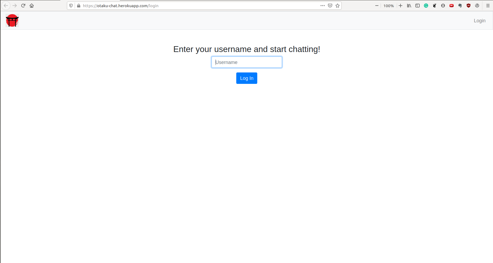
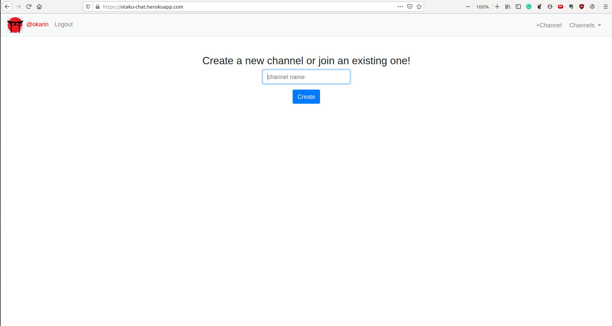
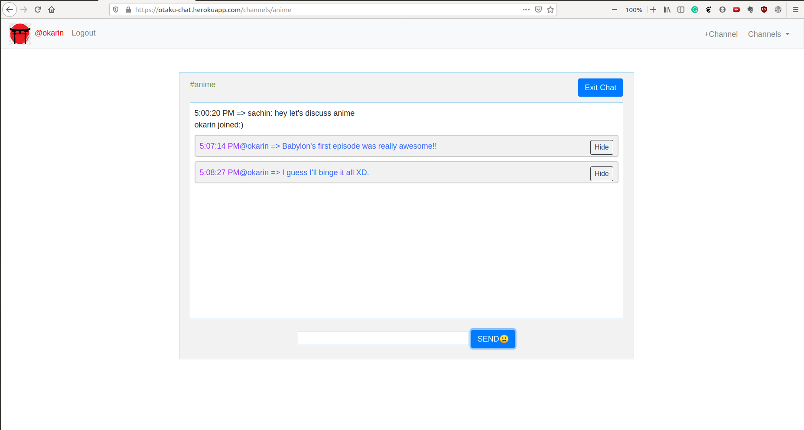

# Otaku-Chat

This is a realtime chating webapp similar to slack, allowing users to create and join channels. 
(Whole lot of subjects can be discussed but I prefer anime discussions:)).

`Localstorage` is used insted of a database to store `sessions`. This is not a secure way, but really good for storing previous sessions and messages for quick rendering of pages.

`/static` contains the *javascript*, *css* and `/img` files.

`/templates` contains the html layout of pages. `layout.html` is the basic templete used by others.

`application.py` is the main application. This runs on the server side.

`helpers.py` has the **login_required** decorator, to falicitate only logged users to be directed to certain pages.

Feature to delete one's own messages is implemeted.

## Usage

- Go to the [site](https://otaku-chat.herokuapp.com/).
- Enter a username.
- Join or make a new channel.
- Chat with other users.
- 楽しんで(Have fun!)

## Screenshots

- ***Login page***

- ***Create page***

- ***Channel page***

